# Producto-Unidad
   ### 1 PLANTEAMIENTO DEL PROBLEMA

En el siguiente informe se dará a conocer las respuestas a las preguntas más recurrentes en el tema das placas como son el Arduino, raspberry pi, microbit que son microordenadores y microcontroladores.  Una de los principales problemas es que no sabemos ¿qué es?, de ahí nos surgen otra serie de preguntas que deseamos conocer sus respuestas; ¿cómo funciona?, ¿para qué sirve?, sus características, aplicaciones; por ello esta investigación que ayudará a conocer la plataforma de cada uno de ellos. Este tipo de tarjetas de desarrollo basadas en microcontroladores que permitan a los estudiantes poder programar en este tipo de tarjeta de manera directa sobre ellas, después de haber practicado y programado en los simuladores usados. Lo cual hace que sea necesaria la implementación de una tarjeta de desarrollo con microcontrolador durante el estudio de esta materia Arquitectura de computadoras. Arduino, Raspberry pi, micro bit son plataformas de desarrollo de múltiples aplicaciones, utilizadas para propósito general, que surgen como propulsores de la iniciativa de inventar, crear e innovar desde gadgets prácticos de uso cotidiano hasta aplicaciones más complejas.

### 2 OBJETIVOS

#### Objetivos General.

Demostrar las funciones y aplicaciones de la plataforma hardware y software basada en microcontrolador a través de una tarjeta (Ardurino, Raspeberry PI, MircoBit), que permita la enseñanza de los microcontroladores.

#### Objetivos Específicos.

Aprender y comprender la lógica de programación de las tarjetas Arduino, Raspberry Pi, Microbit. 
Conocer los principales componentes electrónicos de cada una de las placas a estudiar.
Analizar el funcionamiento de los simuladores correspondientes a cada una de las placas de microcontroladores y posteriormente realizar una simulación.

### 3 ESTADO DEL ARTE

Este tipo de placas son vistas como opción debido a su relativo bajo costo teniendo en cuenta todas las oportunidades que ofrecen. En el presente documento se hace una breve exposición de las capacidades de cada plataforma, así como algunas aplicaciones que demuestran que fortaleza y debilidad tiene cada una.

#### Arduino. 

En 2005 comienzan aparecer plataformas de desarrollo denominadas Hardware Libre [4]. Estas plataformas integran un dispositivo microcontrolador, típicamente basado en un procesador de 8 bits (ATmega168 en sus inicios, y ATmega328 en la actualidad) con un software de desarrollo fácil de usar por cualquier persona con conocimientos de lenguaje C, y con una gran cantidad de documentación y librerías desarrolladas por los usuarios de la plataforma y distribuida libremente por Internet. Esto permitió que una gran cantidad de personas pudieran integrar dispositivos embebidos en sus proyectos sin la necesidad de tener conocimientos profundos en la utilización de sistemas embebidos o conocimiento en electrónica.Permite que un usuario pueda migrar sus desarrollos de un dispositivo a otro de una forma tan simple como lo es definir el tipo de tarjeta de desarrollo a programar por Arduino IDE. Sin embargo, las diferencias entre cada equipo debido al microcontrolador de cada tarjeta generan las siguientes interrogantes con respecto a las capacidades de cada equipo, específicamente (i) para un mismo código escrito en Arduino IDE[6]
Arduino es una herramienta de origen italiano para desarrollar aplicaciones electrónicas de tipo Open Source o código abierto. Principalmente se basa en la facilidad de uso de una tarjeta hardware y de un entorno de programación, para leer y controlar multitud de magnitudes físicas de nuestro alrededor. Debido a la filosofía del proyecto, está dirigido a todo tipo de usuarios, desde programadores experimentados, hasta artistas, diseñadores y entusiastas que Arduino puede ser usado para desarrollar proyectos interactivos, tomando medidas desde Switches y sensores, controlando motores, arrays de leds y un sin fin de elementos electrónicos. Además, todos los proyectos pueden ser ejecutados desde la tarjeta Arduino o también ser controlados desde un entorno en un ordenador, haciendo las aplicaciones configurables e interactivas. Arduino ofrece multitud de tarjetas y módulos de expansión, que permiten al usuario incluir funcionalidad avanzada a sus proyectos, desde conexión de red Ethernet, hasta almacenamiento en tarjetas de memoria SD. Arduino está controlado por un microcontrolador que gobierna el sistema, este se programa en un lenguaje propio de Arduino, el cual está basado en Wiring, el cual a su vez es una modificación del lenguaje C/C++ ampliamente conocido. De esta forma se ofrece al usuario una API (Application program interface) de muy alto nivel en términos de programación. Por supuesto el entorno de programación de Arduino se puede obtener de forma gratuita. Para incrementar la potencia de las tarjetas de propósito general como la Arduino UNO, además se ofertan varios módulos o expansiones (conocidas en la comunidad Arduino como Shields) que pueden ser conectadas a las tarjetas base. Estos Shields se conectan en cascada verticalmente hacia arriba (insertadas y apiladas), de forma que la distribución de pines encaja correctamente con la tarjeta base.

#### Raspberry Pi.

La Raspberry Pi (RPi) es un ordenador de placa reducida, conocida también como minicomputadora, placa única o de placa simple (SBC). Desde el año 2012 que empezó su distribución a nivel mundial, las RPi han sido bien recibidas tanto para uso escolar como particular. La minicomputadora soporta el sistema operativo Raspbian (derivado de Debian) distribuido por fabricación, sin embargo, puede aceptar sistemas operativos en base Linux e incluso Windows®10. Acepta diferentes lenguajes de programación (Python, Java, etc.). La programación se realiza desde un entorno de desarrollo (Geany) o desde la misma consola del sistema para el uso de los puertos GPIO (General Purpose Input/Output, Entrada/Salida de Propósito General).[8]
La plataforma alternativa a Arduino en nuestro proyecto es la basada en la Raspberry Pi. Hay que destacar que esta plataforma ofrece funcionalidad avanzada superior a la Arduino y por ello terminaremos seleccionándola. Conviene hacer hincapié en los detalles de esta plataforma debido a su creciente popularidad en el ámbito de las SBCs y a la proliferación de alternativas cada vez más populares, aunque cabe reseñar que el éxito de Raspberry Pi como plataforma de bajo costo ha sido un boom a nivel mundial. Raspberry Pi es una minicomputadora del tamaño de una tarjeta de crédito capaz de funcionar con una televisión digital y poder conectar múltiples periféricos tales como un teclado, un ratón, etc. Se podría ver como un pequeño PC que puede ser usado de forma similar a muchas de las aplicaciones que nuestro PC de escritorio puede hacer. Podemos utilizar hojas de cálculo, procesadores de texto, videojuegos, ver video de alta definición, así como aplicaciones profesionales tales como servidor NAS, servidor WEB, servidor Multimedia, etc. Raspberry Pi, es un es un ordenador de tamaño de tarjeta de crédito que se conecta a su televisor y un teclado. Es una placa que soporta varios componentes necesarios en un ordenador común. Es un pequeño ordenador capaz, que puede ser utilizado por muchas de las cosas que su PC de escritorio hace, como hojas de cálculo, procesadores de texto y juegos. También reproduce vídeo de alta definición. Esta plataforma empezó la revolución a nivel microprocesador, ya que este diseñado modo de un miniordenador. Usa lenguajes de alto nivel como Python, C++ y Java. El proyecto para su implementación se inició a partir del hecho que los estudiantes no eran eficientes en detalles técnicos de computación, es decir, con fines didácticos. Fue así que se desarrolló esta computadora en miniatura de bajo costo y relativo alto desempeño que permite a una nueva generación de estudiantes a interactuar con sus computadoras en una forma nunca antes imaginada.
La RPi funciona como un enlace de comunicación entre el usuario que envía señales de activación del proceso, a través de una interfaz de usuario, y el mundo exterior, por medio de un módulo de relevadores para manipular los dispositivos que permitan llevar las acciones del circuito hidráulico automatizado[8].

#### Micro bit.

Micro bit es una pequeña tarjeta programable de 4x5 cm diseñada para que aprender a programar sea fácil, divertido y al alcance de todos. Gracias a la gran cantidad de sensores que incorpora, sólo con la tarjeta se pueden llevar a cabo centenares de proyectos. BBC micro: bit también es una plataforma IoT (Internet de las cosas), lo que la hace muy interesante para usuarios avanzados. MicroBit es una tarjeta de circuitos del tamaño de la palma de una mano con una serie de 25 ledes y un chip Bluetooth para conexión inalámbrica. Puede ser programada para mostrar letras, números y otros símbolos y caracteres. Micro Bit fue diseñada para alentar a los niños a participar activamente en la creación de software para computadoras y la creación de nuevas cosas, en lugar de ser consumidores de medios. Creada para funcionar junto con otros sistemas, como Raspberry Pi.
Es posible utilizar todas las plataformas informáticas principales: Windows, MacOS y Linux para la programación. MakeCode y JavaScript se programa a través del navegador web en el Micro: página web de bits [9]. Se utiliza el enlace "Vamos a codificar" y el código se coloca en la nube entonces. Por lo tanto, una red es necesario. Por el contrario, la red no es necesaria cuando programación en Python porque se realiza localmente a través de Mu Editor [9]. El código se compila en formato binario y luego cargado en el Micro: bit con cable USB.

Analizamos la capacidad que tiene la placa para conformar sistemas más complejos, además del impacto que ha tenido en el campo del aprendizaje de introducción a las ciencias computacionales, enfocándose en la electrónica y programación básica.
#### BBC Micro: Bit. Introducción a la mecatrónica en estudios preuniversitarios
Se hace una breve descripción de lo que conforma esta placa de desarrollo, destacando su facilidad para programar y la capacidad de acceso a todo el hardware, para concluir con una comparación de la misma con las otras dos placas que también se han expuesto en este trabajo de investigación como son la placa Arduino y la raspberry pi.

Comparativa. –  En resumen, podemos observar a la raspberry pi como una placa bastante completa y competente con la desventaja de ser compleja para programar, ser poco intuitiva y en general difícil de operar ya que se requiere tener un cierto nivel de programación para poder realizar diseños y controles más atractivos, mientras que la placa Arduino es mas sencilla de programar con solo conocimientos básicos en la materia, además de que se puede encontrar bastante información en la red. Por su lado la placa BBC Micro: bit se considera una placa bastante novedosa y polivalente que permite al usuario adquirir un nivel de conocimiento básico para iniciarse dentro del mundo de la programación de hardware.

La principal característica que se hace destacar de las tres es la capacidad de introducir prácticamente cualquier tipo de sensor. Y como orden de aprendizaje se recomienda empezar usando Micro: bit, para luego movernos a Arduino antes de avanzar a raspberry pi.
#### “Creating cool stuff” – Pupils’ experience of the BBC micro: bit
Aquí se expone como la introducción de las ciencias de la computación en el cronograma educativo de las escuelas en muchos países incentivó al uso de herramientas interactivas y accesibles que permitieran a los estudiantes aproximarse a los conceptos de forma práctica.

Las principales características que destacan son el diseño que es gráficamente atractivo y táctil, económicamente accesible, fácil de usar, interactivo y extensible. Podemos notar el énfasis en la computación física que se resume en los siguientes puntos clave:

•	Aumento en la motivación de los estudiantes sin importar el área porque la experiencia de aprendizaje y los resultados son visibles de forma física y no virtual.

•	La naturaleza tangible de dispositivos físicos ayuda a los estudiantes a tener conexiones más naturales con la tecnología. 

•	Trabajar con dispositivos se presta para trabaja en grupo, mismo que se puede dividir en áreas como el diseño de la interfaz de hardware, diseño del algoritmo y la acción de la interfaz de usuario.

•	Los estudiantes se relacionan con la naturaleza física de las tareas, dando rienda suelta a la creatividad al momento de proponer un proyecto.

#### Pregunta de investigación.
Cuáles son las posibilidades de la placa BBC Micro: bit dentro del aula de clases. Esta se enfocó en cuatro áreas:

-	Percepción de la placa

-	Posibles barreras y facilitadores del uso del dispositivo

-	Uso de recursos para la placa

-	Uso de la placa para un plan de estudios más amplio

#### Metodología.
Se adopto un enfoque cualitativo para capturar la amplitud del compromiso de los alumnos el dispositivo entrevistando a profesores y alumnos sobre sus experiencias.

#### Participantes.
Se reclutaron 15 escuelas del reino unido. Los maestros en el estudio tuvieron una variedad de experiencias de informática.
#### Conclusiones.
Se encontró que el Micro: bit motiva a los estudiantes a trabajar creativamente. El estudio sugiere que la tangibilidad del dispositivo es un elemento clave para estimular el interés y apoyar la comprensión.
#### Teaching Computational Reasoning without a Computer
De acuerdo con estudios realizados en 2018 el trabajo más cotizado fue el de desarrollador de aplicaciones de software. Aquí se expone sobre los beneficios de programas que permiten incentivar el conocimiento sobre programación. Se ve al uso de herramientas codificación básica la manera idónea de potenciar esta natural interacción de las nuevas generaciones con la tecnología ya que con esta realizan una gran cantidad de actividades de las cuales la que menos destaca es la de crear cosas nuevas o investigar.

Algunas de las herramientas que sirvieron como inspiración aquí fueron las siguientes:

•	Edublocks

•	Scottie go!
•	Mojobot

•	Microsoft Makecode

Estos tienen la característica de basar su ambiente de programación con una interfaz de bloques que de alguna manera permiten al usuario simular la interacción con ciertas partes del hardware de un dispositivo. 

El concepto de incluir estar herramientas fue probado en algunas actividades extracurriculares de los estudiantes y se obtuvo bastante información.

Fue probado con niños de 6 a 12 años. La mayoría de ellos dijo que la interfaz tipo piezas de rompecabezas fue bastante fácil de usar, también muy divertido y que querrían utilizarlo otra vez. Algunos de ellos no estaban de acuerdo con los aspectos descritos anteriormente, dijeron que era un poco difícil y que no compartían el mismo entusiasmo al respecto.
### 4.MARCO TEÓRICO .

#### Microcontroladores

En 1971 apareció el primer microprocesador el cual originó un cambio decisivo en las técnicas de diseño de la mayoría de los equipos. Al principio se creía que el manejo de un microprocesador era para aquellas personas con un coeficiente intelectual muy alto; por lo contrario, con la aparición de este circuito integrado todo sería mucho más fácil de entender y los diseños electrónicos serían mucho más pequeños y simplificados. Entre los microprocesadores más conocidos tenemos el popular Z-80 y el 8085. Los diseñadores de equipos electrónicos ahora tenían equipos que podían realizar mayor cantidad de tareas en menos tiempo y su tamaño se redujo considerablemente; sin embargo, después de cierto tiempo aparece una nueva tecnología llamada microcontrolador que simplifica aún más el diseño electrónico.
Un microcontrolador es un circuito integrado digital que puede ser usado para muy diversos propósitos debido a que es programable. Está compuesto por una unidad central de proceso (CPU), memorias (ROM y RAM) y líneas de entrada y salida (periféricos). Como podrás darte cuenta, un microcontrolador tiene los mismos bloques de funcionamiento básicos de una computadora lo que nos permite tratarlo como un pequeño dispositivo de cómputo. "Un microcontrolador es una computadora de un solo chip. Micro se refiere a que el dispositivo es pequeño y controlador, es decir que es empleado en sistemas de control” S. Romero (2010). Un microprocesador difiere de un Microcontrolador en muchos aspectos. La principal es que un microprocesador requiere severos componentes externos para su operación, como memoria de programa y memoria de datos, dispositivos de Entrada/Salida, y un circuito de reloj externo. Un microcontrolador tiene todos los chips de soporte incorporados dentro del único chip. Todos los microcontroladores operan en conjunto de instrucciones almacenada en la memoria. En esta nueva era de la Industria 4.0, popularmente conocida como Internet de las Cosas e Internet of Things (IoT), los microcontroladores son una interesante solución en el campo de la electrónica con una arquitectura eficiente para soportar una amplia gama de opciones de conectividad.

### 4.1 Hardware.

### Raspberry Pi.

.

#### Almacenamiento
La Raspberry Pi no tiene un disco duro tradicional, para ello dispone de un lector/ranura para memorias SD, un sistema de almacenamiento en estado sólido. El arranque del sistema se hará desde la propia tarjeta SD, con lo que debido a que tiene que albergar todo el sistema operativo, es necesario que la tarjeta mayor de 2 GB de capacidad para almacenar todos los archivos requeridos. Para poder arrancar el S.O. será necesario primero instalar (flashear) un sistema operativo en la tarjeta antes de poder trabajar con ella.

### Ardurino Uno.

Las características generales de todas las placas Arduino son las siguientes:

El microprocesador ATmega328.

32 kbytes de memoria Flash.

1 kbyte de memoria RAM.

16 MHz

13 pins para entradas/salidas digitales (programables)

5 pins para entradas analógicas

6 pins para salidas analógicas (salidas PWM)

Voltaje de operación 5V

Voltaje de entrada (limite) 6-20 V

Digital I/O Pins 14 (con 6 salidas PWM)

Entradas analógicas Pins 6

Memoria Flash 32 KB (2 KB para el bootloader)

SRAM 1 KB

Velocidad de reloj 16 MHz

### Componentes.

#### Alimentación (1)(2)

Cada placa Arduino necesita una forma de estar alimentado eléctricamente. Esta puede ser alimentado desde un cable USB que viene de su ordenador o un cable de corriente eléctrica con su respectivo adaptador. La conexión USB  tipo B o mini es también cómo va a cargar código en su placa Arduino. La tensión recomendada para la mayoría de los modelos de Arduino es de entre 6 y 12 voltios.

Pines
Los pines en la placa Arduino es donde se conectan los cables de un circuito. El Arduino tiene varios tipos diferentes de entradas, cada uno de las cuales está marcado en el tablero y utilizan para diferentes funciones:

#### GND (3)

Abreviatura de "tierra" , hay varios pines GND en el Arduino, cualquiera de los cuales pueden ser utilizados para conectar a tierra el circuito.

#### 5V (4) y 3.3V (5)

Son los suministros pin 5V 5 voltios de energía, y los suministros de pin 3.3V 3.3 voltios de potencia.

#### Analógico (6)

El área de pines en el marco del 'analógica' etiqueta (A0 a A5) son analógicas. Estos pines pueden leer la señal de un sensor analógico (como un sensor de temperatura) y convertirlo en un valor digital que podemos leer.

#### Digital (7)

Son los pines digitales (del 0 al 13). Estos pines se pueden utilizar tanto para la entrada digital (como decir, si se oprime un botón) y salida digital (como encender un LED).

#### PWM (8)

Usted puede haber notado la tilde (~) al lado de algunos de los pines digitales (3, 5, 6, 9, 10 y 11). Estos pines actúan como pines digitales normales, pero también se pueden usar para algo llamado Modulación por ancho de pulsos (PWM, por sus siglas en Ingles).

#### AREF (9)

Soportes de referencia analógica. La mayoría de las veces se puede dejar este pin solo. A veces se utiliza para establecer una tensión de referencia externa (entre 0 y 5 voltios) como el límite superior para los pines de entrada analógica.

#### Botón de reinicio (10)

Empujando este botón se conectará temporalmente el pin de reset a tierra y reinicie cualquier código que se carga en el Arduino. Esto puede ser muy útil si el código no se repite, pero quiere probarlo varias veces.

#### LED de alimentación (11)

Este LED debe encenderse cada vez que conecte la placa Arduino a una toma eléctrica. Si esta luz no se enciende, hay una buena probabilidad de que algo anda mal.

#### LEDs RX TX (12)

Estos LEDs nos darán algunas buenas indicaciones visuales siempre nuestro Arduino está recibiendo o transmitiendo datos (como cuando nos estamos cargando un nuevo programa en el tablero).

#### Microcontrolador (13)

Lo negro con todas las patas de metal es un circuito integrado es como el cerebro de nuestro Arduino, es el procesador que se encarga de ejecutar las instrucciones de los programas. La principal IC en el Arduino es ligeramente diferente del tipo de placa a placa, esto puede ser importante, ya que puede necesitar para saber el tipo de IC antes de cargar un nuevo programa desde el software de Arduino. Pero es por lo general de la línea de ATmega de CI de la empresa ATMEL. Esto puede ser importante, ya que puede necesitar para saber el tipo de IC (junto con su tipo de tarjeta) antes de cargar un nuevo programa desde el software de Arduino.Esta información se puede encontrar en la escritura en la parte superior de la IC.

#### Regulador de Voltaje (14)

Regulador de voltaje hace exactamente lo que dice - que controla la cantidad de tensión que se deja en la placa Arduino.

#### Chip de interface USB (16)

Es el encargado de controlar la comunicación con el puerto USB.

#### Reloj oscilador (15)

Es el elemento que hace que el Arduino vaya ejecutando las instrucciones. Es el encargado de marcar el ritmo al cual se debe ejecutar cada instrucción del programa.

.

### Micro bit

#### 1.	Procesador (Nordic nRF51822): 
CPU ARM Cortex-M0 de 16MHz a 32 bits, memoria flash de 256KB, 16KB RAM estática con 2.4GHz en red inalámbrica Bluetooth de bajo consumo de energía, que le permite conectar micro: bit con dispositivos móviles que ejecuten Android e iOS.

#### 2.	Brújula (NXP/Freescale MAG3110): 
Le permite medir la intensidad del campo magnético en cada uno de los tres ejes.

#### 3.	Acelerómetro (NXP/Freescale MMA8652): 
Le permite medir la aceleración y el movimiento a lo largo de tres ejes.

#### 4.	Controlador USB (NXP/Freescale KL26Z): 
Microcontrolador ARM Cortex-M0 + de 48MHz, que incluye un controlador USB 2.0 On-The-Go (OTG) de velocidad completa, que se usa como interfaz de comunicación entre el USB y el microcontrolador principal Nordic.

#### 5.	Conector micro USB: 
Le permite conectar la tarjeta micro: bit con una computadora para cargar códigos o alimentarla con 5V.

#### 6.	Antena inteligente Bluetooth: 
Una antena impresa que transmite señales Bluetooth en la banda de 2.4GHz.

#### 7.	Botón RESET: 
Le permite restablecer el micro: bit y reiniciar el programa que se está ejecutando actualmente o poner el micro: bit en modo de mantenimiento.

#### 8.	Conector JST de la batería: 
Le permite alimentar la tarjeta micro: bit con 2 baterías AAA, o con una batería Li-Po de una celda.

#### 9.	LED del sistema: 
El LED de color amarillo indica la alimentación USB (sin parpadear) y transferencia de datos (parpadeando). No indica la carga de la batería.

#### 10.	Pines de entrada y salida: 
Dispone de 25 conectores diminutos en su borde inferior siendo los pines 0,1,2, 3V y GND de mayor tamaño. Todo tipo de componentes electrónicos adicionales típicos de Arduino: leds, servomotores, sensores, pulsadores Para utilizar el resto de patillas será necesario insertar la placa en un shield o placa de expansión.

#### 11.	Matriz de leds:
La placa incorpora una matriz de 5×5 leds que proporcionan múltiples posibilidades para mostrar datos: números, textos, animaciones, etc.

#### 12.	Botones programables:
Dispone de un botón A y un botón B que permiten programar acciones que se disparan mediante su pulsación.

#### 13.	Comunicación inalámbrica:  
También dispone de conexión Bluetooth para facilitar la comunicación de la placa con dispositivos móviles, etc. Ofrece conexión por radio para la comunicación de una placa con otra.

#### 14.	Alimentación: 
Se puede adquirir aparte un pack de 2 pilas de batería AAA que se conectan a la tarjeta para que funcione sin necesidad de estar conectada al ordenador por USB.

. 

### 4.2 Software.

### Placa Arduino Uno.

### Tinkercad.

Tinkercad es una aplicación gratuita en línea de diseño e impresión 3D, desarrollada por Autodesk, la cual permite realizar simulaciones en tiempo real, programación de dispositivos Arduino virtuales, los sketch se pueden elaborar utilizando texto o bloques (de forma similar a la aplicación Scratch), también es una herramienta que permite exportar el circuito a diagrama. Es interesante la idea de poder diseñar circuitos electrónicos en el PC y simular su funcionamiento. Dispone de un entorno muy ameno con el que vamos seleccionando los elementos activos y pasivos que necesitamos, comenzando desde una placa Protoboard. Una vez montado el circuito con una placa controladora Arduino, podremos escribir el código. Para ello, habrá que clicar sobre el icono “Code” y se optará por la opción de programación por bloques, texto o mixta. Ésta última muestra las dos opciones (bloques y texto) simultáneamente.

#### Programación por bloques.

El bloque de código es una sección de código con una o más declaraciones y sentencias. Un lenguaje de programación que permite bloques incluyendo bloques anidados dentro de otros bloques. Los bloques son piezas que contienen ciertos códigos, en un orden determinado, y esos bloques admiten cambiar valores para anidar otros bloques en variables o huecos, y así se van colocando según las necesidades de lo que queremos programar. En un lenguaje de programación estructurado en bloque, los nombres de las variables y otros objetos, como los procedimientos que son declarados en bloques externos son visibles dentro de otros bloques internos, a menos que sean sombreado por un objeto del mismo nombre. Con estas aplicaciones, el programador maneja estos bloques y sus conexiones y, normalmente, no es necesario añadir líneas escritas. Las aplicaciones para programar por bloques son adecuadas para introducir los conceptos básicos de programación a niños de diversos rangos de edad, además de ser útiles para trabajar otras habilidades, como el pensamiento computacional o la creatividad.

#### Programación por Texto.

El lenguaje del Arduino está basado en el mítico lenguaje C, el lenguaje del Arduino es una versión reducida y mucho más sencilla de manejar que el lenguaje C. El objetivo de este lenguaje es que puedas programar de una manera intuitiva concentrándote en lo que quieres hacer más que en la manera de hacerlo. Las librerías permiten programar los pins digitales como puertos de entrada o salida, leer entradas analógicas, controlar servos o encender y apagar motores de continua. La mayor parte de estas librerías de base (“core libraries”) forman parte de una macro librería llamada Wiring desarrollada por Hernando Barragán.

### Placa Raspberry Pi
### Create.withcode.uk
Create.withcode.uk es una herramienta gratuita que le permite escribir, ejecutar, depurar y compartir programas de Python en su navegador web.
No necesita descargar ni instalar nada. Los programas de Python no pueden acceder a sus archivos o dañar su computadora, por lo que es una forma segura de aprender a crear con código.
Este sitio está diseñado para maestros y estudiantes que desean (o necesitan) aprender programación de Python.
La pagina web tiene un blog llamado blog.withcode.uk en el cual podemos aprender todo sobre ella y de igual manera poder observar ejemplos de programas en desarrollados en Python, de igual manera podemos encontrar el como programar en la misma.
Este blog tiene como objetivo tener ideas de proyectos de programación, enlaces y recursos que puede usar en casa o en el aula, pero la herramienta principal en el centro de este sitio es create.withcode.uk.
### Python
Python es un interpretado , de alto nivel , de propósito general lenguaje de programación . Creado por Guido van Rossum y lanzado por primera vez en 1991, la filosofía de diseño de Python enfatiza la legibilidad del código con su uso notable de espacios en blanco significativos . Sus construcciones de lenguaje y su enfoque orientado a objetos tienen como objetivo ayudar a los programadores a escribir código claro y lógico para proyectos a pequeña y gran escala.
Python fue concebido a fines de la década de 1980 como un sucesor del lenguaje ABC.
Python es un lenguaje de programación multi-paradigmático . La programación orientada a objetos y la programación estructurada son totalmente compatibles, y muchas de sus características admiten programación funcional y programación orientada a aspectos (incluso mediante metaprogramación y metaobjetos (métodos mágicos)). Muchos otros paradigmas son compatibles a través de extensiones, incluido el diseño por contrato y la programación lógica .
La filosofía central del lenguaje se resume en el documento The Zen of Python ( PEP 20 ), que incluye aforismos tales como:
•	Hermoso es mejor que feo.
•	Explícito es mejor que implícito.
•	Simple es mejor que complejo.
•	Complejo es mejor que complicado.
•	La legibilidad cuenta.
Entre los aspectos importantes a tener en cuenta en el lenguaje son los siguientes:
#### Sintaxis y Semántica
Python está destinado a ser un lenguaje fácil de leer. Su formato es visualmente ordenado, y a menudo usa palabras clave en inglés donde otros idiomas usan signos de puntuación. A diferencia de muchos otros lenguajes, no utiliza llaves para delimitar bloques, y los puntos y comas después de las declaraciones son opcionales. Tiene menos excepciones sintácticas y casos especiales que C o Pascal .
#### Sangría
Python usa sangría de espacios en blanco , en lugar de llaves o palabras clave, para delimitar bloques . Un aumento en la sangría viene después de ciertas declaraciones; Una disminución en la sangría significa el final del bloque actual. Por lo tanto, la estructura visual del programa representa con precisión la estructura semántica del programa. Esta característica a veces se denomina la regla de fuera de juego , que algunos otros idiomas comparten, pero en la mayoría de los idiomas, la sangría no tiene ningún significado semántico.

### 5. DIAGRAMAS
#### Diagrama de flujo del ejemplo "promedio" realizado en Withcode.uk
##### Ingreso de datos por teclado y proceso
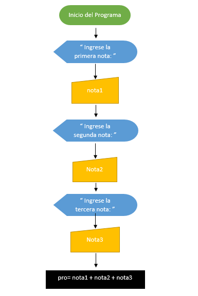
##### Comparacion de datos y resultado
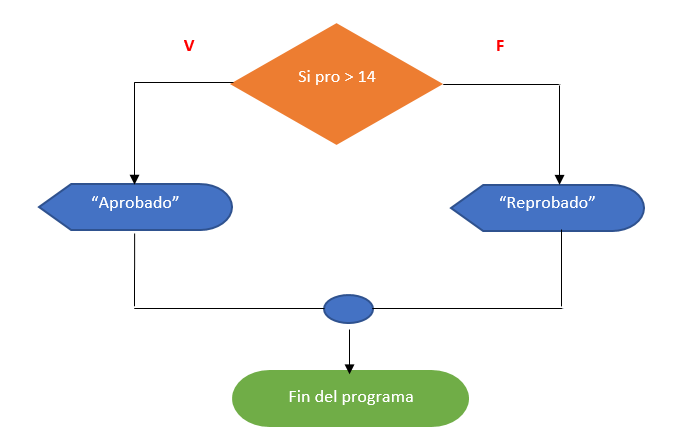

### 6. MAPA DE VARIABLES
#### 6.1 Lenguaje de programación Python 
En Python no es realmente necesario declarar las variables, ya que el lenguaje las identifica inmediatamente, pero, un verificador de tipo estático opcional experimental llamado mypy admite la verificación de tipo en tiempo de compilación.

### 6.2  Lenguaje de programacion de Arduino uno

Para la programacion de nuestro programa en nuestra plataforma ya analisada debemos conocer el nombre de las funciones y su funcionamineto, sintaxis de esta para no comenter muchos errores en la programacion de nuestro circuito.

### 7. EXPLICACIÓN DEL CÓDIGO FUENTE
### 7.1 Raspberry Pi-Withcode.uk
#### 1)	Juego del ahorcado
En este ejemplo lo realizaremos en la página de creat.withcode.uk ya que es la que nos permite programar en lenguaje Python que va relacionado directamente con la placa Raspberry Pi.
El primer ejemplo es de un juego muy conocido como lo es del ahorcado, el cual consiste en, adivinar una palabra y tendremos un determinado número de vida.
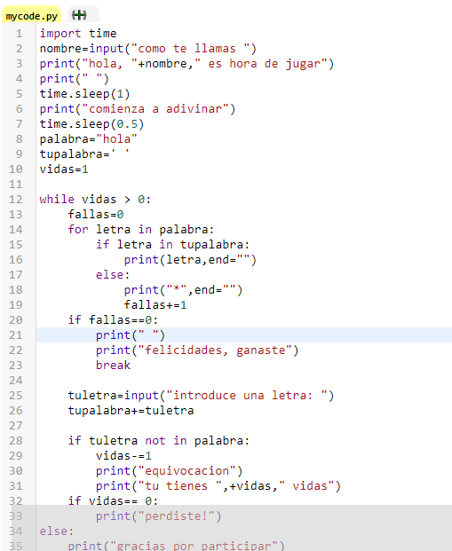
##### La import declaración, que se usa para importar módulos cuyas funciones o variables se pueden usar en el programa actual.
La utilizaresmo para importar el modulo time para crear espacios de tiempo en la ejecución del programa.

##### El input declaración, entrada por teclado.

##### La if declaración, que ejecuta condicionalmente un bloque de código, junto con else y elif (una contracción de else-if).
La utilizaremos para compara los datos ingresado con los datos definidos en el codigo.

##### La while declaración, que ejecuta un bloque de código siempre que su condición sea verdadera.
Servira para que el programa continue mientras no perdamos las vidas.

##### La break declaración, sale del bucle.
Servira para terminar el programa siempre y cuando ganemos.
#### Resultado
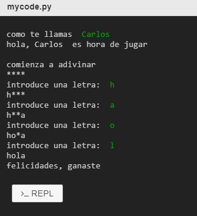

#### 2) Promedio
En el siguiente ejemplo realizaremos un programa en el cual nos permita ingresar 3 notas y calculara el promedio y nos informara si el estudiante esta aprobado o reprobado.

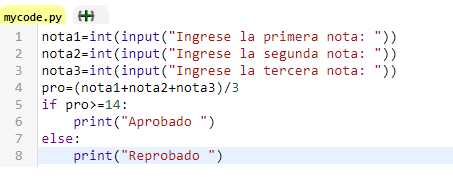
##### El input declaración, entrada por teclado.
Mas la int declaración, servirá para ingresar datos numéricos por teclado.
##### La if declaración, que ejecuta condicionalmente un bloque de código, junto con else y elif (una contracción de else-if).
Compara el promedio y determinar si está aprobado o reprobado.
#### Resultado
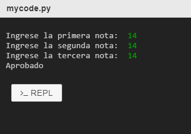

### 7.2 Arduino Uno - TINKERCAD

### 1) SEMAFORO

Para los dos ejemplos de simulación usaremos la plataforma de Tinkercad.com ya que esta nos ofrece trabajar con la placa de Arduino Uno. En este ejemplo emularemos el comportamiento que tiene un semáforo de la vida real, este constará de encender cada uno de los leds en un tiempo determinado, el que se encargará de proporcionar el dato de encendido de la nuestra serie será el pulsador, las salidas será representadas por los leds para observar el comportamiento de nuestra serie.

### COMPONENTES

Una vez escogidos nuestros elementos que necesitaremos para nuestro ejemplo, empezaremos con el cableado de nuestra placa de Arduino y la protoboard. para este caso necesitaremos 3 leds, 4 resistencias 220 ohms, un pulsador, placa de Arduino, protoboard. 

### ENTRADAS/SALIDAS

Identificaremos nuestra salida que será el pin 13, pin 12, pin 8 son los leds y nuestra entrada que será el pin7 este sera representado por nuestro pulsador.

###  PROGRAMACION DEL CODIGO.

Comenzaremos declarando nuestras variables con Int e igualándolas con el valor de entrada o salida correspondiente a nuestra placa de Arduino. El pin de entrada es el pin 7 correspondiente al pulsador y el de salida el pin13, pin12, pin8. Además de esto declararemos variables de estado para los leds y el pulsador. Con la función void setup declararemos las salidas requerida por nuestro circuito. Empezamos con la función Void loop para iniciar la ejecución de nuestro código y estableceremos condiciones para ejecutar las instrucciones por un periodo de tiempo(delay).
Usaremos (digitalwrite) para darle la instrucción a nuestra variable de salida que hacer si encenderse (HIGH) o apagarse (LOW) por un determinado tiempo(delay) y así encender el otro consecutivamente.

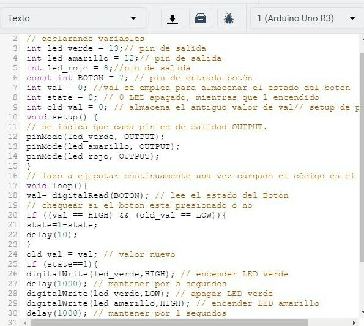

### RESULTADOS

Como podemos ver al momento de presionar el pulsador nuestro código lee ese estado del botón y mantiene la serie ejecutándose de manera continua. Ya que en el código especificamos que el primer led en prenderse sea el verde y continúe de a su derecha indefinidamente.

### 2) ENCENDIDO Y APAGADO DE UN LED.

En este ejemplo se realizará el encendido de un led mediante un pulsador, cuando tengamos mantenido el pulsador el led se encenderá y cuando lo soltemos el led se apagará. La entrada del dato será representada por el pulsador esta esta en el pin 2 de las entradas de nuestro Arduino uno. La salida se representará por medio del led y esta tendrá su correspondiente pin de salida en nuestra placa la cual es el pin 8. Para este ejemplo usaremos 1 leds,1 pulsador,2 resistencias 330 ohms, Arduino, protoboard. Empezaremos con la conexión de nuestra placa con nuestro protoboard, conectando el pin 5v con la parte positiva del protoboard y el pin GND a la parte negativa de este. Montaremos nuestro Circuito como vemos en la imagen y empezaremos con el desarrollo de nuestro código.

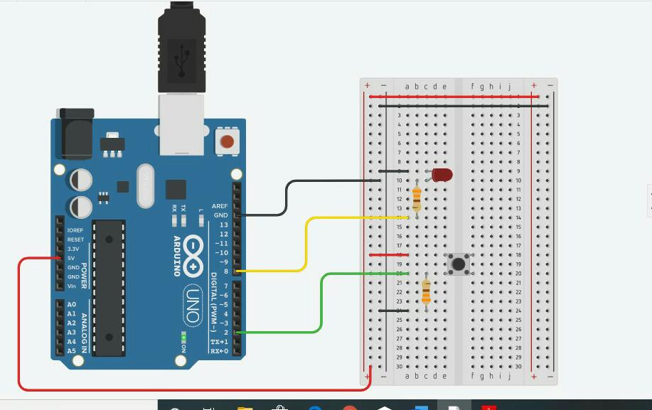

### ENTRADAS/SALIDAS

Nuestra entrada del dato sera representado por nuestro pulsador, su entrada estara en el pin #2 de nuestro Arduino.
Las salida sera representada por el led y su pin#8 sera la salida asignada en nuestra placa de Arduino.

### PROGRAMACION DEL CODIGO.

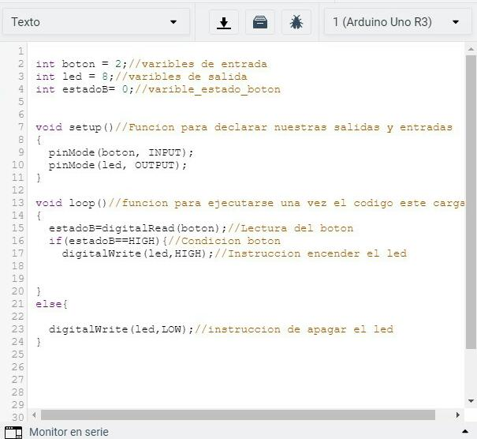

Empezaremos con la declaración de nuestras variables, luego colocaremos la función void setup para declarar nuestras entradas y salidas que requerimos para nuestro circuito, después colocaremos nuestra función void loop para ejecutar el código. Ingresaremos la función Digitalread para dar una lectura constante al botón y determinar con la función siguiente la instrucción a seguir encender o apagar el led. Comprobamos que el código funcione y no rebote un error procederemos a la simulación.

### RESULTADOS.

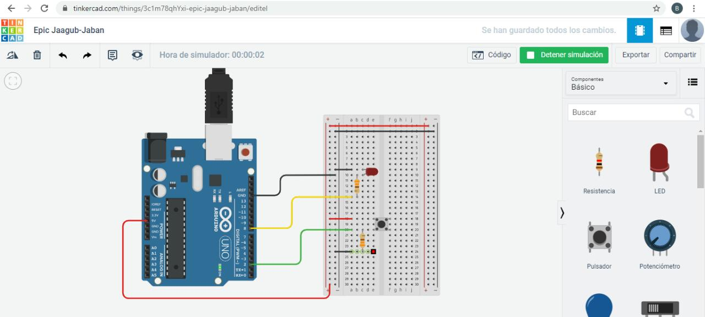

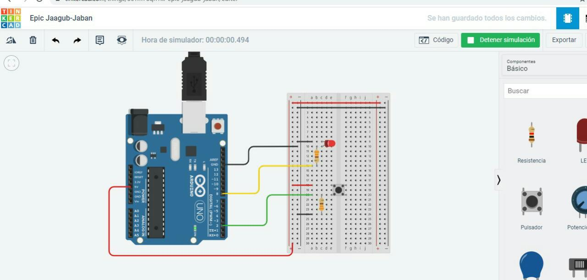

Como podemos observar la ejecución del simulador y  hacemos las pruebas, comprobamos  nuestro programa es exitoso tanto el ensamblaje como el codigo.

#### BBC Micro: bit
En octubre del 2013, el nuevo director General de la BBC anuncio que en el 2015 se realizaría una campaña educacional para conseguir que toda la nación codificara y creara proyectos en la realidad digital. BBC learning llevo su dispositivo al equipo de “Make it digital” quienes hicieron una propuesta. La respuesta de BBC learning fue sugerir el proveer de un millón de pequeñas placas para niños de 11 y 12 años en el Reino Unido a través de sus escuelas.

En 2014 BBC hizo circular una invitación para compañías y organizaciones para asociarse con el proyecto de servicio para conseguir que niños del Reino Unido Codifiquen y la respuesta fue increíble.

#### Sensores de la micro:bit
Brújula, Acelerómetro, Sensor de luz ambiente (pantalla), Botones, Termómetro.

### 8. CONCLUSIONES

### 9. RECOMENDACIONES

### 10. CRONOGRAMA

### 11. BIBLIOGRAFÍA

### 12. ANEXOS
#### 12.1 MANUAL DE USUARIO
#### Withcode.uk

### TINKERCAD

