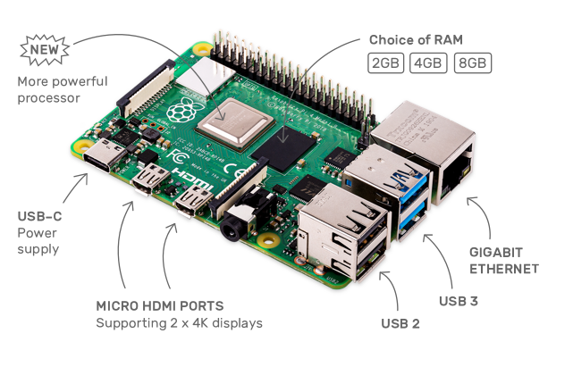
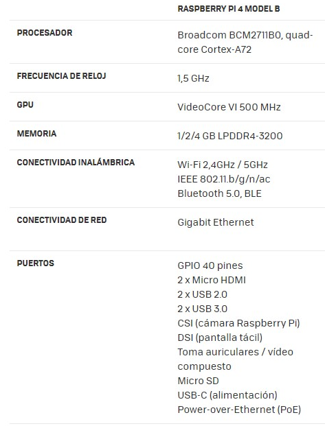
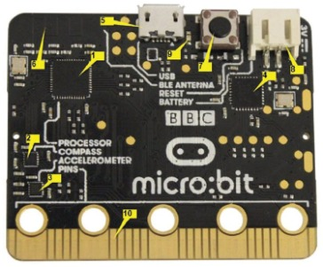

# Producto-Unidad
   ### 1 PLANTEAMIENTO DEL PROBLEMA

En el siguiente informe se dará a conocer las respuestas a las preguntas más recurrentes en el tema das placas como son el Arduino, raspberry pi, microbit que son microordenadores y microcontroladores.  Una de los principales problemas es que no sabemos ¿qué es?, de ahí nos surgen otra serie de preguntas que deseamos conocer sus respuestas; ¿cómo funciona?, ¿para qué sirve?, sus características, aplicaciones; por ello esta investigación que ayudará a conocer la plataforma de cada uno de ellos. Este tipo de tarjetas de desarrollo basadas en microcontroladores que permitan a los estudiantes poder programar en este tipo de tarjeta de manera directa sobre ellas, después de haber practicado y programado en los simuladores usados. Lo cual hace que sea necesaria la implementación de una tarjeta de desarrollo con microcontrolador durante el estudio de esta materia Arquitectura de computadoras. Arduino, Raspberry pi, micro bit son plataformas de desarrollo de múltiples aplicaciones, utilizadas para propósito general, que surgen como propulsores de la iniciativa de inventar, crear e innovar desde gadgets prácticos de uso cotidiano hasta aplicaciones más complejas.

### 2 OBJETIVOS

#### Objetivos General.

Demostrar las funciones y aplicaciones de la plataforma hardware y software basada en microcontrolador a través de una tarjeta (Ardurino, Raspeberry PI, MircoBit), que permita la enseñanza de los microcontroladores.

#### Objetivos Específicos.

Aprender y comprender la lógica de programación de las tarjetas Arduino, Raspberry Pi, Microbit. 
Conocer los principales componentes electrónicos de cada una de las placas a estudiar.
Analizar el funcionamiento de los simuladores correspondientes a cada una de las placas de microcontroladores y posteriormente realizar una simulación.

### 3 ESTADO DEL ARTE

Este tipo de placas son vistas como opción debido a su relativo bajo costo teniendo en cuenta todas las oportunidades que ofrecen. En el presente documento se hace una breve exposición de las capacidades de cada plataforma, así como algunas aplicaciones que demuestran que fortaleza y debilidad tiene cada una.

#### Arduino. 

En 2005 comienzan aparecer plataformas de desarrollo denominadas Hardware Libre [4]. Estas plataformas integran un dispositivo microcontrolador, típicamente basado en un procesador de 8 bits (ATmega168 en sus inicios, y ATmega328 en la actualidad) con un software de desarrollo fácil de usar por cualquier persona con conocimientos de lenguaje C, y con una gran cantidad de documentación y librerías desarrolladas por los usuarios de la plataforma y distribuida libremente por Internet. Esto permitió que una gran cantidad de personas pudieran integrar dispositivos embebidos en sus proyectos sin la necesidad de tener conocimientos profundos en la utilización de sistemas embebidos o conocimiento en electrónica.Permite que un usuario pueda migrar sus desarrollos de un dispositivo a otro de una forma tan simple como lo es definir el tipo de tarjeta de desarrollo a programar por Arduino IDE. Sin embargo, las diferencias entre cada equipo debido al microcontrolador de cada tarjeta generan las siguientes interrogantes con respecto a las capacidades de cada equipo, específicamente (i) para un mismo código escrito en Arduino IDE[6]
Arduino es una herramienta de origen italiano para desarrollar aplicaciones electrónicas de tipo Open Source o código abierto. Principalmente se basa en la facilidad de uso de una tarjeta hardware y de un entorno de programación, para leer y controlar multitud de magnitudes físicas de nuestro alrededor. Debido a la filosofía del proyecto, está dirigido a todo tipo de usuarios, desde programadores experimentados, hasta artistas, diseñadores y entusiastas que Arduino puede ser usado para desarrollar proyectos interactivos, tomando medidas desde Switches y sensores, controlando motores, arrays de leds y un sin fin de elementos electrónicos. Además, todos los proyectos pueden ser ejecutados desde la tarjeta Arduino o también ser controlados desde un entorno en un ordenador, haciendo las aplicaciones configurables e interactivas. Arduino ofrece multitud de tarjetas y módulos de expansión, que permiten al usuario incluir funcionalidad avanzada a sus proyectos, desde conexión de red Ethernet, hasta almacenamiento en tarjetas de memoria SD. Arduino está controlado por un microcontrolador que gobierna el sistema, este se programa en un lenguaje propio de Arduino, el cual está basado en Wiring, el cual a su vez es una modificación del lenguaje C/C++ ampliamente conocido. De esta forma se ofrece al usuario una API (Application program interface) de muy alto nivel en términos de programación. Por supuesto el entorno de programación de Arduino se puede obtener de forma gratuita. Para incrementar la potencia de las tarjetas de propósito general como la Arduino UNO, además se ofertan varios módulos o expansiones (conocidas en la comunidad Arduino como Shields) que pueden ser conectadas a las tarjetas base. Estos Shields se conectan en cascada verticalmente hacia arriba (insertadas y apiladas), de forma que la distribución de pines encaja correctamente con la tarjeta base.

#### Raspberry Pi.

La Raspberry Pi (RPi) es un ordenador de placa reducida, conocida también como minicomputadora, placa única o de placa simple (SBC). Desde el año 2012 que empezó su distribución a nivel mundial, las RPi han sido bien recibidas tanto para uso escolar como particular. La minicomputadora soporta el sistema operativo Raspbian (derivado de Debian) distribuido por fabricación, sin embargo, puede aceptar sistemas operativos en base Linux e incluso Windows®10. Acepta diferentes lenguajes de programación (Python, Java, etc.). La programación se realiza desde un entorno de desarrollo (Geany) o desde la misma consola del sistema para el uso de los puertos GPIO (General Purpose Input/Output, Entrada/Salida de Propósito General).[8]
La plataforma alternativa a Arduino en nuestro proyecto es la basada en la Raspberry Pi. Hay que destacar que esta plataforma ofrece funcionalidad avanzada superior a la Arduino y por ello terminaremos seleccionándola. Conviene hacer hincapié en los detalles de esta plataforma debido a su creciente popularidad en el ámbito de las SBCs y a la proliferación de alternativas cada vez más populares, aunque cabe reseñar que el éxito de Raspberry Pi como plataforma de bajo costo ha sido un boom a nivel mundial. Raspberry Pi es una minicomputadora del tamaño de una tarjeta de crédito capaz de funcionar con una televisión digital y poder conectar múltiples periféricos tales como un teclado, un ratón, etc. Se podría ver como un pequeño PC que puede ser usado de forma similar a muchas de las aplicaciones que nuestro PC de escritorio puede hacer. Podemos utilizar hojas de cálculo, procesadores de texto, videojuegos, ver video de alta definición, así como aplicaciones profesionales tales como servidor NAS, servidor WEB, servidor Multimedia, etc. Raspberry Pi, es un es un ordenador de tamaño de tarjeta de crédito que se conecta a su televisor y un teclado. Es una placa que soporta varios componentes necesarios en un ordenador común. Es un pequeño ordenador capaz, que puede ser utilizado por muchas de las cosas que su PC de escritorio hace, como hojas de cálculo, procesadores de texto y juegos. También reproduce vídeo de alta definición. Esta plataforma empezó la revolución a nivel microprocesador, ya que este diseñado modo de un miniordenador. Usa lenguajes de alto nivel como Python, C++ y Java. El proyecto para su implementación se inició a partir del hecho que los estudiantes no eran eficientes en detalles técnicos de computación, es decir, con fines didácticos. Fue así que se desarrolló esta computadora en miniatura de bajo costo y relativo alto desempeño que permite a una nueva generación de estudiantes a interactuar con sus computadoras en una forma nunca antes imaginada.
La RPi funciona como un enlace de comunicación entre el usuario que envía señales de activación del proceso, a través de una interfaz de usuario, y el mundo exterior, por medio de un módulo de relevadores para manipular los dispositivos que permitan llevar las acciones del circuito hidráulico automatizado[8].

#### Micro bit.

Micro bit es una pequeña tarjeta programable de 4x5 cm diseñada para que aprender a programar sea fácil, divertido y al alcance de todos. Gracias a la gran cantidad de sensores que incorpora, sólo con la tarjeta se pueden llevar a cabo centenares de proyectos. BBC micro: bit también es una plataforma IoT (Internet de las cosas), lo que la hace muy interesante para usuarios avanzados. MicroBit es una tarjeta de circuitos del tamaño de la palma de una mano con una serie de 25 ledes y un chip Bluetooth para conexión inalámbrica. Puede ser programada para mostrar letras, números y otros símbolos y caracteres. Micro Bit fue diseñada para alentar a los niños a participar activamente en la creación de software para computadoras y la creación de nuevas cosas, en lugar de ser consumidores de medios. Creada para funcionar junto con otros sistemas, como Raspberry Pi.
Es posible utilizar todas las plataformas informáticas principales: Windows, MacOS y Linux para la programación. MakeCode y JavaScript se programa a través del navegador web en el Micro: página web de bits [9]. Se utiliza el enlace "Vamos a codificar" y el código se coloca en la nube entonces. Por lo tanto, una red es necesario. Por el contrario, la red no es necesaria cuando programación en Python porque se realiza localmente a través de Mu Editor [9]. El código se compila en formato binario y luego cargado en el Micro: bit con cable USB

### 4.MARCO TEÓRICO .

#### Microcontroladores

En 1971 apareció el primer microprocesador el cual originó un cambio decisivo en las técnicas de diseño de la mayoría de los equipos. Al principio se creía que el manejo de un microprocesador era para aquellas personas con un coeficiente intelectual muy alto; por lo contrario, con la aparición de este circuito integrado todo sería mucho más fácil de entender y los diseños electrónicos serían mucho más pequeños y simplificados. Entre los microprocesadores más conocidos tenemos el popular Z-80 y el 8085. Los diseñadores de equipos electrónicos ahora tenían equipos que podían realizar mayor cantidad de tareas en menos tiempo y su tamaño se redujo considerablemente; sin embargo, después de cierto tiempo aparece una nueva tecnología llamada microcontrolador que simplifica aún más el diseño electrónico.
Un microcontrolador es un circuito integrado digital que puede ser usado para muy diversos propósitos debido a que es programable. Está compuesto por una unidad central de proceso (CPU), memorias (ROM y RAM) y líneas de entrada y salida (periféricos). Como podrás darte cuenta, un microcontrolador tiene los mismos bloques de funcionamiento básicos de una computadora lo que nos permite tratarlo como un pequeño dispositivo de cómputo. "Un microcontrolador es una computadora de un solo chip. Micro se refiere a que el dispositivo es pequeño y controlador, es decir que es empleado en sistemas de control” S. Romero (2010). Un microprocesador difiere de un Microcontrolador en muchos aspectos. La principal es que un microprocesador requiere severos componentes externos para su operación, como memoria de programa y memoria de datos, dispositivos de Entrada/Salida, y un circuito de reloj externo. Un microcontrolador tiene todos los chips de soporte incorporados dentro del único chip. Todos los microcontroladores operan en conjunto de instrucciones almacenada en la memoria. En esta nueva era de la Industria 4.0, popularmente conocida como Internet de las Cosas e Internet of Things (IoT), los microcontroladores son una interesante solución en el campo de la electrónica con una arquitectura eficiente para soportar una amplia gama de opciones de conectividad.

### 4.1 Hardware.

### Raspberry Pi.

.

#### Almacenamiento
La Raspberry Pi no tiene un disco duro tradicional, para ello dispone de un lector/ranura para memorias SD, un sistema de almacenamiento en estado sólido. El arranque del sistema se hará desde la propia tarjeta SD, con lo que debido a que tiene que albergar todo el sistema operativo, es necesario que la tarjeta mayor de 2 GB de capacidad para almacenar todos los archivos requeridos. Para poder arrancar el S.O. será necesario primero instalar (flashear) un sistema operativo en la tarjeta antes de poder trabajar con ella.

### Ardurino Uno.

### Componentes.

#### Alimentación (1)(2)

Cada placa Arduino necesita una forma de estar alimentado eléctricamente. Esta puede ser alimentado desde un cable USB que viene de su ordenador o un cable de corriente eléctrica con su respectivo adaptador. La conexión USB es también cómo va a cargar código en su placa Arduino. La tensión recomendada para la mayoría de los modelos de Arduino es de entre 6 y 12 voltios.
Pines
Los pines en la placa Arduino es donde se conectan los cables de un circuito. El Arduino tiene varios tipos diferentes de entradas, cada uno de las cuales está marcado en el tablero y utilizan para diferentes funciones:

#### GND (3)

Abreviatura de "tierra" , hay varios pines GND en el Arduino, cualquiera de los cuales pueden ser utilizados para conectar a tierra el circuito.

#### 5V (4) y 3.3V (5)

Son los suministros pin 5V 5 voltios de energía, y los suministros de pin 3.3V 3.3 voltios de potencia.

#### Analógico (6)

El área de pines en el marco del 'analógica' etiqueta (A0 a A5) son analógicas. Estos pines pueden leer la señal de un sensor analógico (como un sensor de temperatura) y convertirlo en un valor digital que podemos leer.

#### Digital (7)

Son los pines digitales (del 0 al 13). Estos pines se pueden utilizar tanto para la entrada digital (como decir, si se oprime un botón) y salida digital (como encender un LED).

#### PWM (8)

Usted puede haber notado la tilde (~) al lado de algunos de los pines digitales (3, 5, 6, 9, 10 y 11). Estos pines actúan como pines digitales normales, pero también se pueden usar para algo llamado Modulación por ancho de pulsos (PWM, por sus siglas en Ingles).

#### AREF (9)

Soportes de referencia analógica. La mayoría de las veces se puede dejar este pin solo. A veces se utiliza para establecer una tensión de referencia externa (entre 0 y 5 voltios) como el límite superior para los pines de entrada analógica.

#### Botón de reinicio (10)

Empujando este botón se conectará temporalmente el pin de reset a tierra y reinicie cualquier código que se carga en el Arduino. Esto puede ser muy útil si el código no se repite, pero quiere probarlo varias veces.

#### LED de alimentación (11)

Este LED debe encenderse cada vez que conecte la placa Arduino a una toma eléctrica. Si esta luz no se enciende, hay una buena probabilidad de que algo anda mal.

#### LEDs RX TX (12)

Estos LEDs nos darán algunas buenas indicaciones visuales siempre nuestro Arduino está recibiendo o transmitiendo datos (como cuando nos estamos cargando un nuevo programa en el tablero).

#### Microcontrolador (13)

Lo negro con todas las patas de metal es un circuito integrado es como el cerebro de nuestro Arduino, es el procesador que se encarga de ejecutar las instrucciones de los programas. La principal IC en el Arduino es ligeramente diferente del tipo de placa a placa, esto puede ser importante, ya que puede necesitar para saber el tipo de IC antes de cargar un nuevo programa desde el software de Arduino. Esta información se puede encontrar en la escritura en la parte superior de la IC.

#### Regulador de Voltaje (14)

Regulador de voltaje hace exactamente lo que dice - que controla la cantidad de tensión que se deja en la placa Arduino.

#### Chip de interface USB (16)

Es el encargado de controlar la comunicación con el puerto USB.

#### Reloj oscilador (15)

Es el elemento que hace que el Arduino vaya ejecutando las instrucciones. Es el encargado de marcar el ritmo al cual se debe ejecutar cada instrucción del programa.

.

### Micro bit

1.	Procesador (Nordic nRF51822): CPU ARM Cortex-M0 de 16MHz a 32 bits, memoria flash de 256KB, 16KB RAM estática con 2.4GHz en red inalámbrica Bluetooth de bajo consumo de energía, que le permite conectar micro: bit con dispositivos móviles que ejecuten Android e iOS.

2.	Brújula (NXP/Freescale MAG3110): le permite medir la intensidad del campo magnético en cada uno de los tres ejes.

3.	Acelerómetro (NXP/Freescale MMA8652): le permite medir la aceleración y el movimiento a lo largo de tres ejes.

4.	Controlador USB (NXP/Freescale KL26Z): microcontrolador ARM Cortex-M0 + de 48MHz, que incluye un controlador USB 2.0 On-The-Go (OTG) de velocidad completa, que se usa como interfaz de comunicación entre el USB y el microcontrolador principal Nordic.

5.	Conector micro USB: le permite conectar la tarjeta micro: bit con una computadora para cargar códigos o alimentarla con 5V.

6.	Antena inteligente Bluetooth: una antena impresa que transmite señales Bluetooth en la banda de 2.4GHz.

7.	Botón RESET: le permite restablecer el micro: bit y reiniciar el programa que se está ejecutando actualmente o poner el micro: bit en modo de mantenimiento.

8.	Conector JST de la batería: le permite alimentar la tarjeta micro: bit con 2 baterías AAA, o con una batería Li-Po de una celda.

9.	LED del sistema: El LED de color amarillo indica la alimentación USB (sin parpadear) y transferencia de datos (parpadeando). No indica la carga de la batería.

10.	Pines de entrada y salida Dispone de 25 conectores diminutos en su borde inferior siendo los pines 0,1,2, 3V y GND de mayor tamaño. Todo tipo de componentes electrónicos adicionales típicos de Arduino: leds, servomotores, sensores, pulsadores Para utilizar el resto de patillas será necesario insertar la placa en un shield o placa de expansión.

11.	Matriz de leds. La placa incorpora una matriz de 5×5 leds que proporcionan múltiples posibilidades para mostrar datos: números, textos, animaciones, etc.

12.	Botones programables. Dispone de un botón A y un botón B que permiten programar acciones que se disparan mediante su pulsación.

13.	Comunicación inalámbrica:  También dispone de conexión Bluetooth para facilitar la comunicación de la placa con dispositivos móviles, etc. Ofrece conexión por radio para la comunicación de una placa con otra.

14.	Alimentación. Se puede adquirir aparte un pack de 2 pilas de batería AAA que se conectan a la tarjeta para que funcione sin necesidad de estar conectada al ordenador por USB.

. 

### 4.2 Software.

### Placa Arduino Uno.

### Tinkercad.

Tinkercad es una aplicación gratuita en línea de diseño e impresión 3D, desarrollada por Autodesk, la cual permite realizar simulaciones en tiempo real, programación de dispositivos Arduino virtuales, los sketch se pueden elaborar utilizando texto o bloques (de forma similar a la aplicación Scratch), también es una herramienta que permite exportar el circuito a diagrama. Es interesante la idea de poder diseñar circuitos electrónicos en el PC y simular su funcionamiento. Dispone de un entorno muy ameno con el que vamos seleccionando los elementos activos y pasivos que necesitamos, comenzando desde una placa Protoboard. Una vez montado el circuito con una placa controladora Arduino, podremos escribir el código. Para ello, habrá que clicar sobre el icono “Code” y se optará por la opción de programación por bloques, texto o mixta. Ésta última muestra las dos opciones (bloques y texto) simultáneamente.

### Programación por bloques.

El bloque de código es una sección de código con una o más declaraciones y sentencias. Un lenguaje de programación que permite bloques incluyendo bloques anidados dentro de otros bloques. Los bloques son piezas que contienen ciertos códigos, en un orden determinado, y esos bloques admiten cambiar valores para anidar otros bloques en variables o huecos, y así se van colocando según las necesidades de lo que queremos programar. En un lenguaje de programación estructurado en bloque, los nombres de las variables y otros objetos, como los procedimientos que son declarados en bloques externos son visibles dentro de otros bloques internos, a menos que sean sombreado por un objeto del mismo nombre. Con estas aplicaciones, el programador maneja estos bloques y sus conexiones y, normalmente, no es necesario añadir líneas escritas. Las aplicaciones para programar por bloques son adecuadas para introducir los conceptos básicos de programación a niños de diversos rangos de edad, además de ser útiles para trabajar otras habilidades, como el pensamiento computacional o la creatividad.

### Programación por Texto.

El lenguaje del Arduino está basado en el mítico lenguaje C, el lenguaje del Arduino es una versión reducida y mucho más sencilla de manejar que el lenguaje C. El objetivo de este lenguaje es que puedas programar de una manera intuitiva concentrándote en lo que quieres hacer más que en la manera de hacerlo. Las librerías permiten programar los pins digitales como puertos de entrada o salida, leer entradas analógicas, controlar servos o encender y apagar motores de continua. La mayor parte de estas librerías de base (“core libraries”) forman parte de una macro librería llamada Wiring desarrollada por Hernando Barragán.

### Variables. 

Es simplemente una manera de codificar o representar estos datos dentro de un programa. Las variables pueden ser enteros, reales, binarios, decimales, hexadecimales, textos constantes, etc.

.

Para declara una variable usamos int (Nombre_de_variable) = 0; y le asignamos un valor ya sea de entrada o de salida. El valor al que igualaremos nuestra variable le corresponderá al # del pin de nuestro Arduino uno ya sea de entrado o de salida.

### CONSTANTES.

Algunas variables no cambian de valor durante la ejecución del nuestro programa. En estos casos podemos añadir la palabra reservada ‘const’ al comienzo de la declaración de la variable.

### Sintaxis.

INPUT/OUTPUT (Entrada/Salida). Los pins digitales pueden ser configurados de ambos modos: como entrada (INPUT) o como salida (OUTPUT) mediante la función pinMode(): pinMode (13, OUTPUT);      // Configura el pin 13 como salida digital.

INPUT_PULLUP: Reservado como parámetro de la función pinMode() para el uso de resistencias pull-up integradas en el chip Atmega del Arduino.

LED_BUILTIN: para el uso del Led de serie con el que viene equipado el Arduino (generalmente conectado al pin digital 13).

TRUE/FALSE (Verdadero/Falso). Para el Arduino True (Verdadero) es cualquier valor que no es 0. False (Falso) es el valor 0.

HIGH/LOW (Alto/Bajo). Es el valor lógico en una puerta digital: LOW es el valor 0 -0 Voltios- y HIGH es el valor 1 -5 Voltios.
Estructuras If, else, else if.

digitalRead(pin): Lee el valor de un pin (definido como digital) dando un resultado HIGH (alto) o LOW(bajo). El pin se puede especificar ya sea como una variable o una constante (0-13).

digitalWrite(): Envía al ´pin´ definido previamente como OUTPUT el valor HIGH o LOW (poniendo en 1 o 0 la salida). El pin se puede especificar ya sea como una variable o como una constante (0-13).

AnalogRead(pin):Lee el valor de un determinado pin definido como entrada analógica con una resolución de 10 bits. Esta instrucción sólo funciona en los pines (0-5). El rango de valor que podemos leer oscila de 0 a 1023.

AnalogWrite():Esta instrucción sirve para escribir un pseudo-valor analógico utilizando elprocedimiento de modulación por ancho de pulso (PWM) a uno de los pin´s de Arduino marcados como “pin PWM”. El más reciente Arduino, que implementa el chip ATmega168, permite habilitar como salidas analógicas tipo PWM los pines 3, 5, 6, 9, 10 y 11. Los modelos de Arduino más antiguos que implementan el chip ATmega8, solo tiene habilitadas para esta función los pines 9, 10 y 11. El valor que se puede enviar a estos pines de salida analógica puede darse en forma de variable o constante, pero siempre con un margen de 0-255.

### FUNCIONES

setup() y loop(). Ambas se declaran de tipo void, lo cual significa que no retornan ningún valor. Arduino simplifica muchas tareas proporcionando funciones que permiten controlar entradas y salidas tanto analógicas como digitales, funciones matemáticas y trigonométricas, temporales, etc.

Matemáticas: Operadores matemáticos, generador aleatorio de números, sentencias "y" y "o" que comparan posiciones de los objetos.

Control: Algunos de los bloques de esta categoría contienen los bucles y condicionales que se vieron en el Tema 3. Se incluyen bloques como por siempre, repetir, esperar o si (…) entonces.

Entradas: Para leer información digital del mundo exterior. son las piezas que nos marcan el inicio de un programa. Ya te habrás dado cuenta de que tienen una forma especial, distinta al resto de bloques.

Salidas: Para enviar una señal digital al mundo exterior.

setup(): Se invoca una sola vez cuando el programa empieza. Se utiliza para inicializar los modos de trabajo de los pins, o el puerto serie. Debe ser incluido en un programa aunque no haya declaración que ejecutar.

loop():Hace precisamente lo que sugiere su nombre, se ejecuta de forma cíclica, lo que posibilita que el programa este respondiendo
continuamente ante los eventos que se produzcan en la tarjeta

Comentarios: fundamentales para documentar el proyecto.

pinMode (): La comunicación por el puerto serie y otras configuraciones iniciales.

setup (): Debe contener la declaración de las variables.

DelayVal():se utiliza para poner un valor de retraso en un programa que lee una variable analógica de un potenciómetro conectado a una entrada de Arduino.

### Estructura.

La primera estructura de control que vamos a considerar es el operador “if” (si). Este operador verifica simplemente si un test lógico es cierto o no (es decir, si devuelve el valor true o false) y en función de esto realiza (o no) una serie de acciones. El “else if” hemos introducido un test lógico dentro del “if”: si el valor de las dos variables es idéntico podemos ejecutar un bloque alternativo de acciones.
La estructura básica del lenguaje de programación de Arduino es bastante simple y se compone de al menos dos partes. Estas dos partes necesarias, o funciones, encierran bloques que contienen declaraciones, estamentos o instrucciones. 
En donde setup() es la parte encargada de recoger la configuración y loop() es la que contienen el programa que se ejecutará cíclicamente (de ahí el termino loop –bucle-). Ambas funciones son necesarias para que el programa trabaje. La función de configuración debe contener la declaración de las variables. Es la primera función a ejecutar en el programa, se ejecuta sólo una vez, y se utiliza para configurar o inicializar pinMode (modo de trabajo de las E/S), configuración de la comunicación en serie y otras. La función bucle (loop) siguiente contiene el código que se ejecutara continuamente (lectura de entradas, activación de salidas, etc) Esta función es el núcleo de todos los programas de Arduino y la que realiza la mayor parte del trabajo.

void setup()

{

estamentos;

}

void loop()

{

estamentos;

}

### 5. DIAGRAMAS

### 6. MAPA DE VARIABLES

### 7. EXPLICACIÓN DEL CÓDIGO FUENTE

### 8. COMCLUSIONES

### 9. RECOMENDACIONES

### 10. CRONOGRAMA

### 11. BIBLIOGRAFÍA

### 12. ANEXOS
#### 12.1 MANUAL DE USUARIO

